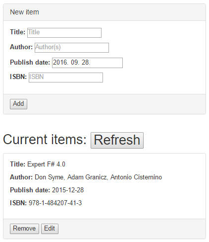
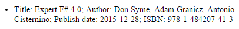
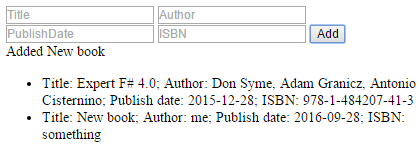
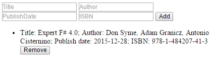
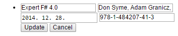

# BookCollection - a simple CRUD application.

This is an introductory tutorial for WebSharper 4 in C#.

The goal is to make a web application that keeps a list of book details on the server
and the client can view, add, remove and change items.
Manipulating the DOM and communicating with the server are both made transparent by
WebSharper works both as a compiler, translating part of your C# code intended to run in browsers to JavaScript and
a server-side component and framework for handling all kinds of web requests.
This enables full type safety from the server-side storage to the client-side view.

The full source code is available on [GitHub](https://github.com/websharper-samples/BookCollection).
The `.md` [source](https://github.com/websharper-samples/BookCollection/blob/master/BookCollection.md) for this tutorial is also included, comments, questions and pull requests are welcome.

### Concepts explored:

* single page applications (SPA project)
* remote method calls
* WebSharper.UI.Next reactive variables and collections, templating

## Starting out

If you are using Visual Studio, download and install the [WebSharper 4 vsix](http://websharper.com/downloads).

Create a new project with the template "WebSharper 4 Single-Page Application" (under the sections "CSharp/WebSharper") named "BookCollection".
This project will contain a short sample application for adding new names to a list.
It is entirely client-side, the only code file `Client.fs` contains a single class annotated with the [JavaScript] attribute.
This code is translated to JavaScript by the WebSharper compiler.
It has a static `Main` method with the `[SPAEntryPoint]` attribute which causes it to run after page load in the browser.

The purpose of Single-Page Applications is to create a responsive web application where full page reloads are unnecessary.
In the original project template, the client is self-contained, no calls to the server are made.
It is translated as a pair of `.js` files, one to be included in the head which loads all required outside resources, and the other containing the application code.
Dead code elimination is used to write only the minimal required code for your application to run.
Also, external libraries like JQuery are only referenced by the `.head.js` if your application uses JQuery directly or indirectly (for example by the DOM features of WebSharper.UI.Next)

The `index.html` file has a link to these compiler generated `.js` files and a `.css` file which is also created by WebSharper by concetanating all style sheet resources found by the automatic dependency search.

## The data model

Create a new code file for a class.

Add `using WebSharper;` to the top and replace the empty class with this:

    [JavaScript, Serializable]
    public class Book
    {
        public int BookId;
        public string Title;
        public string Author;
        public DateTime PublishDate;
        public string ISBN;

        public Book(string title, string author, DateTime publishDate, string isbn)
        {
            Title = title;
            Author = author;
            PublishDate = publishDate;
            ISBN = isbn;
        }

        // required for serialization
        public Book() { }
    }

This class will be shared by the server and client and used for communication.
Remote method calls work like this, WebSharper does it all for you when you use the necessary `[Remote]` and `[JavaScript]` attributes:

* Client serializes the arguments to JSON format, and sends a custom request which specifies the remote method in a header entry.
* The `web.config` file specifies using the `WebSharper.Web.RpcModule` class as a http module. This will recognize the request, deserialize the JSON arguments into .NET classes, and call your method with these.
* Your `[Remote]` annotated method can return a `Task` or `Task<T>`, which are awaited, then the result is serialized back to JSON and sent to the client.
* Client converts the response back into JavaScript objects, and calls the continuation of the pending `async` operation.

The end result is: simple method calls in your code is translated to type-safe communication.
The only thing you have to be careful about is that server-side methods naturally do not have access to objects in the clients, only what are passed to them as arguments.
Modifications made to these objects are not making their way back to client-side state unless explicitly returned.
Therefore it is needed that we have classes that represent the chunks of data we want to move between the clients and server(s).

## The server-side first step

Let us create a new class file with a static class named `Remoting`.
his will contain as static members all the server-side state and functionality.

For simplicity, we are not using a database, just an in-memory collection:

    static ConcurrentDictionary<int, Book> store =
        new ConcurrentDictionary<int, Book>()
        {
            [0] = new Book(
                "Expert F# 4.0",
                "Don Syme, Adam Granicz, Antonio Cisternino",
                new DateTime(2015, 12, 28),
                "978-1-484207-41-3")
        };

First we need a method for retrieving the state of the collection:

    [Remote]
    public static Task<Book[]> GetBooks()
    {
        return Task.FromResult(store.Values.ToArray());
    }

Note that we are returning an array.
Not all types are allowed as Remote method arguments and return types, WebSharper gives a compile-time error whenever a type is invalid.
Primitive value types, arrays, and your own classes with `[JavaScript, Serializable]` are good to use.
`ConcurrentDictionary` currently has no JavaScript implementation (proxy in WebSharper's term) defined, as it would not provide any useful extra functionality in a single-threaded environment.

Also we are using `Task.FromResult` to construct the return value.
Our method is not blocking on the server, so there is no need for an `async` method, however using `Task<T>` is strongly advised for remoting so that the remote call is not blocking on the client.
`Task.FromResult` is the most efficient way to create a `Task` that is already in finished state with a specific result,
so WebSharper remoting responds to the client immediately.

# The client-side first step, visualizing a collection

Let us create a new class file with a class named `Client` with the `[JavaScript]` attribute (add `using WebSharper;`).
This will contain our client-side state and functionality.
For storing a collection that is easily connected to a responsive view, the UI framework for WebSharper provides the `ListModel` class (in `WebSharper.UI.Next`).
This is a dictionary too, for which we can define a key-generator function in the constructor for consistency:

    ListModel<int, Book> Books = new ListModel<int, Book>(b => b.BookId);

Put this inside the `App` class of `Client.cs`. To download the current list from the server, an `async` method is preferred:

    async Task RefreshList()
    {
        Books.Set(await Remoting.GetBooks());
    }

This way, in our main method we can call `Task.Run(RefreshList);` to start the download in a non-blocking way.
A main concept of the `UI.Next` framework is [views](http://websharper.com/docs#web_development/ui.next_-_c-sharp/heading-2-2).
Every reactive variable and collection has a view, which is an interface through which dependent, automatically recalculated values can be defined, which are themselves views.
Our collection can be visualized by using `Books.View.DocSeqCached`, which creates DOM nodes for every item, and when the collection changes, keeps those for which the key has not been touched.

The `index.html` will work as a template collection, containing annotated parts which can be replicated dynamically and have reactive variables bind to them.
Let's add a bare-bone template to the `index.html` file, replace the contents of `body` except the last `script` link with this:

    

        <ul data-hole="ListContainer">
            <li data-template="ListItem">Title: $!{Title}; Author: $!{Author}; Publish date: $!{PublishDate}; ISBN: $!{ISBN}</li>
        </ul>
    

If you save this file, the code generator runs and now you can access methods constructing the `Main` and `ListItem` parts from code as `Template.Index.Main.Doc` and `Template.Index.ListItem.Doc`.
Note that in the html file, the `Main` teplate is defined by a `data-children-template` attribute, this means that the contents of the current element (one or more elements) will be constructed, while `ListItem` is defined by `data-template` and this constructs the current element it is defined on.

Replace the contents of our `Client.Main` method with

    JQuery.Of("#main").Empty();
    Task.Run(RefreshList);
    Template.Index.Main.Doc(
        ListContainer:
            Books.View.DocSeqCached(book =>
                Template.Index.ListItem.Doc(
                    Title: View.Const(book.Title),
                    Author: View.Const(book.Author),
                    PublishDate: View.Const(DateToString(book.PublishDate)),
                    ISBN: View.Const(book.ISBN)
                )
            )
    ).RunById("main");

Clearing the `main` element is necessary because we use a single `index.html` for loading the application and the reactive templates.
`RunById` creates the reactive content with our bindings, `RefreshList` is will finish after this, but once the initial list is downloaded
it is appearing on the page.

## Inserting an item on the server

The server keeps the "official" state of the collection, if that changes, the clients can become outdated.
We will introduce a refresh button and then an auto-refresh for this later.
We have the `nextId` static field so that we can safely generate a unique key for a new item:

    static int nextId;

    [Remote]
    public static Task<int> InsertBook(Book book)
    {
        var id = Interlocked.Increment(ref nextId);
        book.BookId = id;
        store.TryAdd(id, book);
        return Task.FromResult(id);
    }

We are returning the `id` as the client will need to know it for update and remove operations.

## UI for inserting a new item

Let us add a couple new elements inside our `Main` template.

    

        <input data-var="Title" placeholder="Title" />
        <input data-var="Author" placeholder="Author" />
        <input data-var="PublishDate" type="date" />
        <input data-var="ISBN" placeholder="ISBN" />
        <button data-event-click="Add">Add</button>
        
$!{Message}

    

Saving the file, we get errors on the `Template.Index.Main.Doc` call saying we are missing arguments.
The `Title` and other arguments defined by our template expect an `IRef<T>` object, the quickest way to create these is to make new reactive variables.

    var newTitle = Var.Create("");
    var newAuthor = Var.Create("");
    var newPublishDate = Var.Create(DateToString(DateTime.Now));
    var newISBN = Var.Create("");
    var message = Var.Create("");

Now we can bind these by additional parameters in call to `Template.Index.Main.Doc`:

    Title: newTitle,
    Author: newAuthor,
    PublishDate: newPublishDate,
    ISBN: newISBN,
    Message: message.View

The `input` boxes are using two-way binding, so we are passing the `Var`-s themselves which are implementing `IRef<T>`.
This means that a `Var` object works as a value cell, you can read or set its `.Value` property from code, and every change will update its views, in this case, the current contents of the input box.
But also, changes of the input box will change the value of the `Var` cell.

We have one more missing argument, for the event handler we have defined by having `data-event-click="Add"` on a button.
The `Add` argument needs to be a delegate taking a DOM element and event as arguments.
We do not use these, just want to react to the click now.

    Add: async (el, ev) =>
    {
        var publishDate = DateTime.Parse(newPublishDate.Value);
        var book = new Book(newTitle.Value, newAuthor.Value, publishDate, newISBN.Value);
        message.Value = "Adding book";
        book.BookId = await Remoting.InsertBook(book);
        message.Value = "Added " + book.Title;
        Books.Add(book);
        newTitle.Value = newAuthor.Value = newISBN.Value = "";
        newPublishDate.Value = DateToString(DateTime.Now);
    }

Now you can add a new item to the list, and reloading the page shows it is indeed stored on the server-side.

Our event handler will contain a remote call, so it is best to define as an `async` delegate.
We are constructing a new `Book` object to save, but do not add it to our `ListModel` immediately.
We need to get the identifier for it which only the server can produce.
The line `book.BookId = await Remoting.InsertBook(book);` is where the magic happens.
Because `Remoting.InsertBook` is not a `[JavaScript]` but a `[Remote]` annotated method, WebSharper translates this
call to a call to the server.
C#'s `async` and `await` are translated to JavaScript so it works as expected, the single-threaded JavaScript execution is
not blocked by this web request.
Once the server replied, we can add the item to the collection, show a message about it and reset the input boxes.
Note that we only need to reset the underlying values, the views are taken care of automatically.

## Refreshing the client-side state

Let us add another button inside the `main` template:

    <button data-event-click="Refresh">Refresh</button>

With the handler:

    Refresh: async (el, ev) => {
        await RefreshList();
        message.Value = "Collection updated";
    }

Now if we open the page in multiple instances, modify items in one place,
clicking this button in another page synchronizes current state from the server.

## Deleting an item on the server

For deletion, sending an identifier is sufficient.
The item may be already removed by another client, so we could return if this was the case.

    [Remote]
    public static Task<bool> DeleteBook(int id)
    {
        Book removed;
        return Task.FromResult(store.TryRemove(id, out removed));
    }

## UI for removing an item

Lets put a "Remove" button inside the `ListItem` template, so we have a button for every item in the list.
So our `ListItem` looks like this now:

    <li data-template="ListItem">Title: $!{Title}; Author: $!{Author}; Publish date: $!{PublishDate}; ISBN: $!{ISBN}
        <button data-event-click="Remove">Remove</button>
    </li>

This allows us to expand the call to `Template.Index.ListItem.Doc` with specifying a delegate argument for `Remove`:

    Remove: async (el, ev) =>
    {
        message.Value = $"Removing book '{book.Title}'";
        var res = await Remoting.DeleteBook(book.BookId);
        Books.Remove(book);
        if (res)
            message.Value = $"Removed book '{book.Title}'";
        else
            message.Value = $"Book '{book.Title}' was already removed";
    }

## Updating an item on the server

There are multiple ways to handle concurrency when updating a collection.
Now we will modify the current item if it is found by its identifier and ignore the request when the item has already been removed by another call.
We return a `bool` value signaling if the update was successful.

    [Remote]
    public static Task<bool> UpdateBook(Book book)
    {
        if (store.ContainsKey(book.BookId))
        {
            store[book.BookId] = book;
            return Task.FromResult(true);
        }
        else
            return Task.FromResult(false);
    }

## UI for updating an item

The idea is to change the view of an item into editable input boxes on the click of an "Edit" button.
Lets add the basic template for this, first a second button inside the `ListItem` template:

    <button data-event-click="Edit">Edit</button>

And now a new sub-template for an item in editing state:

    <li data-template="EditListItem">
        <input data-var="Title" placeholder="Title" />
        <input data-var="Author" placeholder="Author" />
        <input data-var="PublishDate" type="date" />
        <input data-var="ISBN" placeholder="ISBN" />
        <button data-event-click="Update">Update</button>
        <button data-event-click="Cancel">Cancel</button>
    </li>

The challenge is to switch to representing an item using this template when clicking the "Edit" button.

We would need to store a new state for every item, a `bool` representing if that item is in edit mode.
Lets do this by adding a new field to the `Book` class:

    [NonSerialized]
    public bool IsEdited;

The `NonSerialized` attribute marks that this value is not used for remoting.

Since we added the `Edit` button, the call to `Template.Index.ListItem.Doc` is missing an argument:

    Edit: (el, ev) =>
    {
        book.IsEdited = true;
        Books.Add(book);
    }

This does nothing yet.
But if we would just change a `bool` field on a `Book` object, `UI.Next` would have no way
to register this change. That's why we re-add the item to the list model, it has a unique key
so it will not change the visible representation of the list but signal the change for that key.

Now we can put an `if` statement inside the anonymous function passed to `Books.View.DocSeqCached`
to display the element in edit mode when needed:

    Books.View.DocSeqCached((Book book) =>
    {
        if (book.IsEdited)
        {
            var editTitle = Var.Create(book.Title); // new Vars for editing details
            var editAuthor = Var.Create(book.Author);
            var f = Var.Create(DateToString(book.PublishDate));
            var editISBN = Var.Create(book.ISBN);
            return Template.Index.EditListItem.Doc(
                Title: editTitle,
                Author: editAuthor,
                PublishDate: editPublishDate,
                ISBN: editISBN,
                Update: async (el, ev) =>
                {
                    book.Title = editTitle.Value;
                    book.Author = editAuthor.Value;
                    book.PublishDate = DateTime.Parse(editPublishDate.Value);
                    book.ISBN = editISBN.Value;
                    book.IsEdited = false;
                    var res = await Remoting.UpdateBook(book);
                    if (res)
                    {
                        Books.Add(book);
                        message.Value = $"Updated book '{book.Title}'";
                    }
                    else
                    {
                        Books.Remove(book);
                        message.Value = $"Book '{book.Title}' has not been found, removed";
                    }
                },
                Cancel: (el, ev) =>
                {
                    book.IsEdited = false;
                    Books.Add(book);
                }
            );
        }
        else
            return Template.Index.ListItem.Doc(
                // ... previous code
            );
    }),

A new set of `Var`s are needed as backing for the input fields.
These are created inside the anonymous function for `DocSeqCached` but outside
the `Update` event handler, so they are captured there and so have a lifetime
until the object (element) holding the event handler is in memory.
JavaScript also has garbage collection similarly to .NET, so the same considerations
work for avoiding memory leaks.

## Summary

You can find the entire project on [GitHub](https://github.com/websharper-samples/BookCollection) with an enhanced template.
Client-side code is reorganized a bit, initializing item templates are separated into methods for readability.